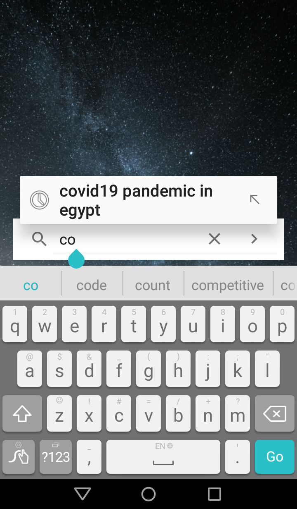
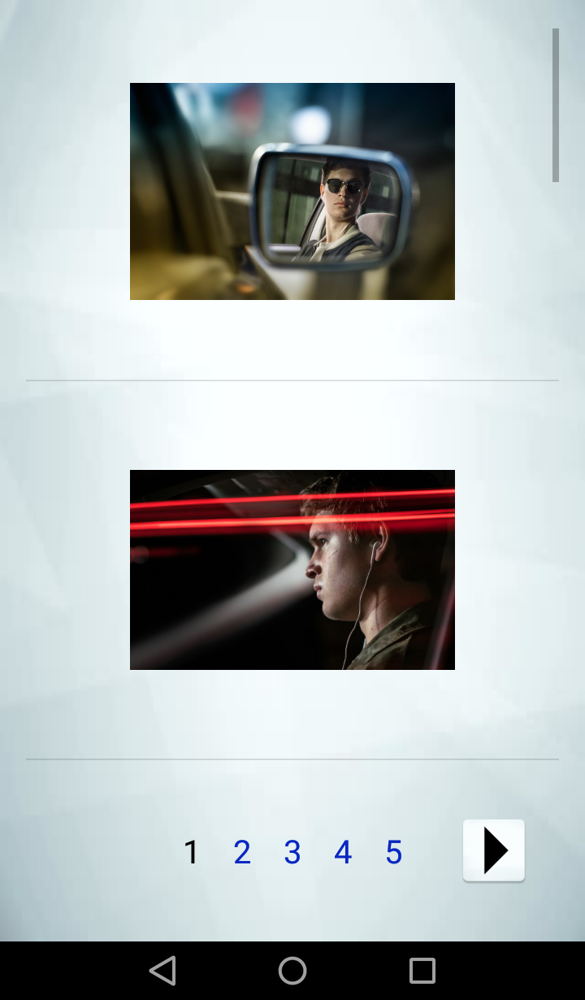

  
  <h2 align="center">Crawler</h2>
  <h4 align="center">A Search-engine Crawler-based that demonstrates the main features of a search engine (web crawling, indexing and ranking)</h4>

  

## Client
[Client README](Client/README.md)

## Server (on AWS Cloud9)
[Server README](Server/README.md)

## Team members
[Ayman Azzam](https://github.com/AymanAzzam)

[Amr Aboshama](https://github.com/Amr-Aboshama)

[Menna Fekry](https://github.com/MennaFekry)

[Reham Ali](https://github.com/rehamaali)
